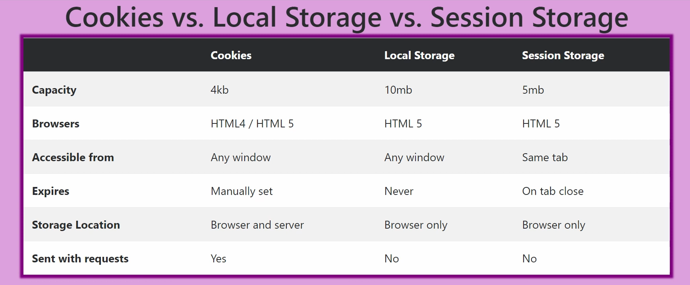
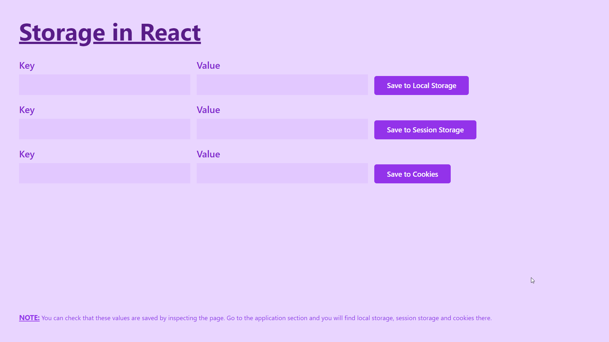

# React Storage Demo
   

In this demo project we learned about the three types of storage used in Web Development:

1. Local Storage
2. Session Storage
3. Cookies

## References
- https://youtu.be/GihQAC1I39Q
- https://www.tutorialspoint.com/difference-between-local-storage-session-storage-and-cookies-in-javascript

## Screenshots

